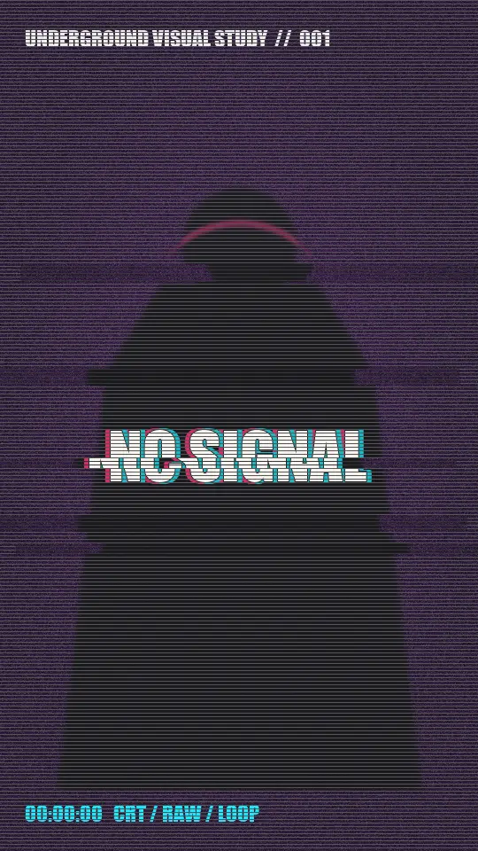

# Seven-second vertical glitch loop — spec sample

An original, soundless 7-second vertical loop demonstrating dirty-CRT texture, chromatic split, kinetic typography, raw cuts, and a seamless repeatable format suitable for a Spotify Canvas concept.

This is self-initiated spec work, not prior client work. The artwork and animation are procedurally generated; no third-party footage is used.

The included Python/Pillow generator makes the production method reproducible.
